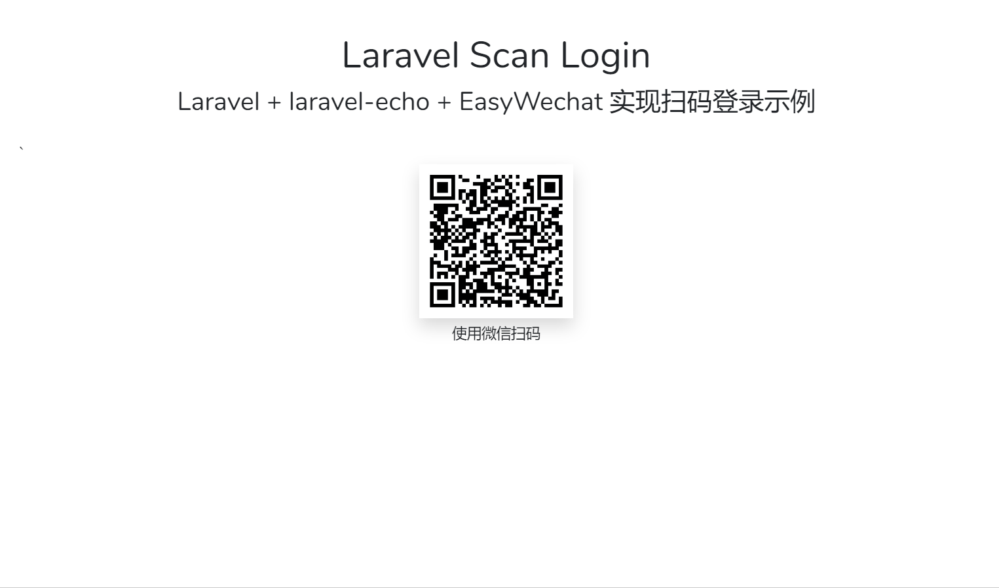

# laravel-qrcode-login

本项目是配置本人博客文章而创建的一个小示例项目。

[博客原文地址](https://tianyong90.com/2019/03/19/laravel-laravel-echo-easywechat-shi-xian-wei-xin-sao-ma-deng-lu/)

示例主要实现使用 Laravel + laravel-echo + EasyWechat 实现扫码登录的功能（非接入第微信开放平台的扫码登录）。

## 大致效果截图

